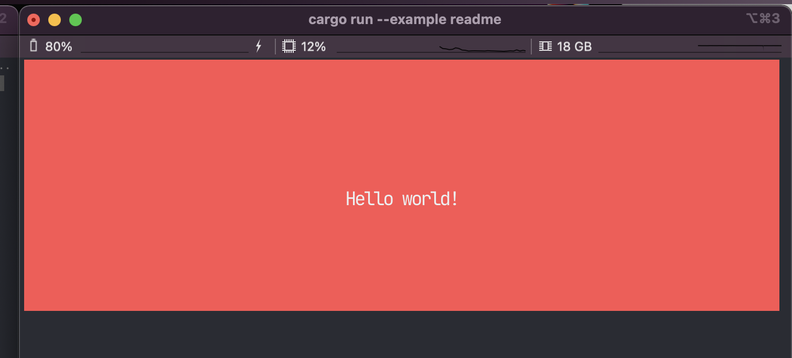

<div align="center">
  <h1>Dioxus TUI</h1>
  <p>
    <strong>Beautiful terminal user interfaces in Rust with <a href="https://dioxuslabs.com/">Dioxus </a>.</strong>
  </p>
</div>

<div align="center">
  <!-- Crates version -->
  <a href="https://crates.io/crates/dioxus">
    
  </a>
  <!-- Downloads -->
  <a href="https://crates.io/crates/dioxus">
    
  </a>
  <!-- docs -->
  <a href="https://docs.rs/dioxus">
    
  </a>
  <!-- CI -->
  <a href="https://github.com/jkelleyrtp/dioxus/actions">
    
  </a>
  <!--Awesome -->
  <a href="https://github.com/dioxuslabs/awesome-dioxus">
    
  </a>
  <!-- Discord -->
  <a href="https://discord.gg/XgGxMSkvUM">
    
  </a>
</div>

<br/>

Leverage React-like patterns, CSS, HTML, and Rust to build beautiful, portable, terminal user interfaces with Dioxus.

```rust
use dioxus::prelude::*;

fn app() -> Element {
    rsx! {
        div {
            width: "100%",
            height: "10px",
            background_color: "red",
            justify_content: "center",
            align_items: "center",
            "Hello world!"
        }
    }
}
```



## Pick the right entrypoint (functions)

- Static HTML you already have: create a `blitz_html::HtmlDocument` with
  `HtmlDocument::from_html(html, DocumentConfig { viewport: Some(Viewport::new(..)), ..Default::default() })`.
- Custom DOM construction: start with `blitz_dom::BaseDocument::new(DocumentConfig { ..Default::default() })`, then
  mutate it through `BaseDocument::mutate()` (returns `DocumentMutator`) to build nodes.
- Dioxus app: use `dioxus_native_dom::DioxusDocument::new(...)` if you want Blitz driven by a Dioxus `VirtualDom`.
- To (re)layout after mutations or resizes: call `BaseDocument::set_viewport(...)` (or `viewport_mut()`) then
  `BaseDocument::resolve(now_seconds_f64)` to run style + layout.
- To paint: implement `anyrender::PaintScene` for your terminal backend and call
  `blitz_paint::paint_scene(&mut scene, &doc, scale, width_px, height_px)`.
- To feed input: call `Document::handle_ui_event(event)` on your document implementation when you receive keyboard/mouse
  events from the terminal.
- To progress async fetches (images/stylesheets): call `Document::poll(task_context)` in your event loop and re-resolve
  when it returns `true`.

## Architecture for a terminal renderer

1. **DOM + Style (Blitz)**: use `BaseDocument` or `HtmlDocument` for parsing, style resolution, and layout (`resolve`).
2. **Display list (Blitz Paint)**: `blitz_paint::paint_scene` traverses the laid-out tree and emits AnyRender paint
   commands.
3. **Terminal adapter (yours)**: implement `anyrender::PaintScene` that:
    - Accumulates text runs into a cell buffer (respect wide chars/emoji widths).
    - Captures image draws into pixel buffers; emit Inline Images Protocol escape sequences at the target cell position
      with the requested pixel size.
    - Applies fills/borders/box shadows as best-effort ANSI or braille/block fallbacks when possible.
4. **Compositor**: diff cell buffers + inline images per frame to minimize redraws. Redraw on resize or when
   `Document::poll`/events require it.

## Inline Images specifics

- The painter will call your `PaintScene::draw_image` (and related) with an RGBA buffer and target rectangle. Encode
  that buffer (e.g., PNG + base64) and emit Inline Images Protocol escapes at the corresponding row/column.
- Keep a mapping from pixel coords to terminal cells to position the image correctly. Use your terminal font metrics (
  cell width/height) to convert `width_px/height_px` to a cell anchor.
- Provide a fallback when the terminal lacks inline image support: downsample to ANSI blocks/braille or skip images.

## Event handling in a TUI

- Map terminal events to `UiEvent` variants and pass them to `Document::handle_ui_event` (clicks, scroll, key input).
  You can synthesize positions by translating cell coords to CSS px via your cell size and current viewport scroll.
- Keep track of hover/focus nodes if you need to show debug overlays; `BaseDocument::get_hover_node_id` helps when
  highlighting.

## Resizing and scrolling

- On every terminal resize, call `BaseDocument::set_viewport` (or mutate via `viewport_mut`) before the next `resolve`.
- Scroll by mutating `BaseDocument::scroll_viewport_by(dx, dy)` (then re-paint). Clamp/quantize to cells if you want
  whole-line scrolling in the terminal.

## What you need to implement

- A terminal `PaintScene` backend that turns AnyRender commands into: (a) a text cell buffer; (b) inline image
  escapes; (c) optional ANSI styling for borders/backgrounds.
- A small compositor that diffs buffers to minimize terminal writes.
- Capability detection (truecolor? inline images? fallback palette) to decide how to map colors and images.

## Future design considerations

- Stabilize a shared TUI scene abstraction so Dioxus/Blitz integrations can swap backends without changing app code.
- Explore richer fallback strategies for terminals without inline images (ANSI dithering, braille downsampling) to keep
  layouts consistent.
- Standardize capability negotiation (truecolor, italics, image support) to guide paint decisions and avoid noisy
  redraws.
- Provide a higher-level ergonomic API for Dioxus apps that hides viewport management and event wiring while keeping
  escape hatches for advanced control.

This separation keeps Blitz responsible for DOM, style, layout, and paint ordering, while your TUI backend only
translates paint commands into terminal-friendly output and cursor movement.
