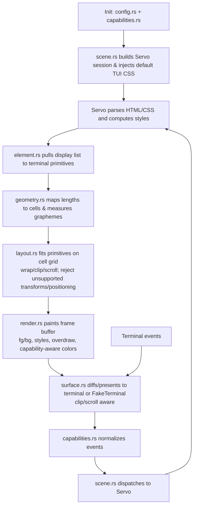

# Design

## Goals
- Render HTML via Blitz/Servo into a terminal grid through `TerminalScene`, with no test-only hooks or hacks and a single render pipeline (no parallel tree walkers).
- Use `FakeTerminal` to verify rendering deterministically and to power runnable examples.

## Servo → terminal mapping
- Cells, not pixels: define fixed cell metrics (no fractional sizes); document how CSS px/pt map to cells and reject/clip unsupported transforms.
- Typography: assume monospace; handle wide/combining/emoji codepoints so text shaping maps cleanly to cell occupancy.
- Colors: normalize to terminal capabilities (palette or truecolor); drop alpha blending/gradients or provide clear fallbacks.
- Clipping/scrolling: clip all painting to the viewport; translate scroll areas to terminal scroll regions, not pixel scroll; avoid partial-line paints.
- Positioning/stacking: constrain absolute/fixed/transform usage; define paint order (z-index) and document unsupported positioning.
- Events: translate keyboard/mouse/focus to Servo expectations; define tab/focus order and IME/clipboard limits; ensure deterministic event delivery for tests.
- Animations/media: freeze or disable animations for tests/examples; define policy for images/video/canvas (block, degrade to ASCII, or omit) with graceful failure.
- Performance: guard against heavy CSS/layout features that do not map well; feature-gate or shed load when limits are exceeded.
- Accessibility: expose semantics that have terminal equivalents (focus cues, links, buttons) and keep them testable via `FakeTerminal`.

## TUI-specific constraints vs GUI
- Cell grid replaces pixels: all layout, clipping, and scrolling are cell-based; no subpixel positioning or partial-line paints.
- Grapheme width matters: measure by grapheme clusters (wide/combining/emoji) to avoid misalignment; monospace assumed but widths vary by codepoint.
- Color caps: terminals may be 16/256/truecolor; no alpha blending. Gradients or overlays must flatten to the available palette.
- Limited layering and effects: last paint per cell wins; no blur/shadow fidelity. Prefer discrete state changes over smooth animations.
- Input fidelity: keyboard-first; mouse/hover/IME/clipboard are constrained and vary by terminal. Design focus cues that survive these limits.
- Capability variance: normalize or negotiate per-terminal quirks (color depth, mouse support, Unicode width differences) and make tests deterministic.

## Testing strategy (TerminalScene + FakeTerminal)
- Fixtures and snapshots: maintain HTML/CSS fixtures mapped to expected snapshots (text grid + attributes: colors, styles, links, cursor, focus). Normalize snapshots to avoid platform noise.
- Determinism: fix terminal size, palette, and event ordering; expose a deterministic render/flush so async paths are testable without races.
- Input/focus: test tab order, scrolling, selection, and form widgets; verify interaction behavior, not just visuals.
- Error handling: include malformed/unsupported HTML/CSS; assert graceful degradation and absence of panics.
- Limits: cover large DOMs, deep nesting, long lines, wide/combining/RTL text; watch for quadratic behaviors.
- CSS/HTML support: validate the supported subset (block/inline, inheritance, defaults) and document unsupported pieces alongside fixtures.
- Backend/capability variance: if multiple terminal capabilities exist, either normalize to a canonical capability set or test each variant explicitly.
- Diagnostics: when snapshots differ, show grid diffs (including attributes) to make failures actionable.

## Examples as contracts
- Pin terminal size/palette and inputs; drive examples through `FakeTerminal` so CI can compare output against stored snapshots.
- Keep examples aligned with the same fixtures/helpers used in tests to avoid divergence.

### Default TUI CSS (example baseline)
Use cell-friendly units and palette roles (mapped per capability profile) to avoid pixel assumptions. Define roles (e.g., `bg-primary`, `fg-primary`, `accent`) and map them to palette indices for 16/256-color, and to RGB for truecolor:
```css
html, body {
  margin: 0;
  padding: 0;
  font-family: monospace;
  background: var(--bg-primary, black);
  color: var(--fg-primary, white);
}
a { color: var(--accent, cyan); text-decoration: underline; }
strong, b { font-weight: bold; }
em, i { font-style: italic; }
code, pre {
  font-family: monospace;
  background: var(--bg-muted, #111);
  padding: 0;
}
ul, ol { margin: 0; padding-left: 2ch; }
button, input, select, textarea {
  background: var(--bg-muted, #111);
  color: var(--fg-primary, white);
  border: none;
  padding: 0;
}
button:focus, input:focus, select:focus, textarea:focus {
  outline: none;
  background: var(--bg-focus, #002b36);
  color: var(--accent, cyan);
}
```
All spacing uses whole-cell units (ch) and avoids px/pt; focus and emphasis rely on color/decoration rather than pixel borders. Provide capability-specific role maps (16/256/truecolor) in tests/examples for deterministic snapshots:
- 16-color: `--bg-primary=black`, `--bg-muted=black`, `--bg-focus=blue`, `--fg-primary=white`, `--accent=cyan`
- 256-color: map roles to palette indices (e.g., `--bg-primary=16`, `--bg-muted=235`, `--bg-focus=24`, `--fg-primary=252`, `--accent=45`)
- truecolor: map roles to RGB values (e.g., `--bg-primary=#000000`, `--bg-muted=#111111`, `--bg-focus=#002b36`, `--fg-primary=#e0e0e0`, `--accent=#00bcd4`)

## Immediate next steps
- Finalize cell/size mapping and color capability policy for Blitz/Servo in TUI mode (single source of truth in `geometry.rs` + palette role maps).
- Define the snapshot format and normalization helpers (using `FakeTerminal`).
- Enumerate the HTML/CSS feature matrix and pick representative fixtures.
- Add tests covering layout, styles/inheritance, links/lists/forms, overflow/wrapping, wide/combining/RTL text, malformed inputs, capability variants, and event normalization (keyboard/mouse/focus) against deterministic clocks.
- Wire examples to the same helpers and document how to run/compare them in CI.
- Introduce a deterministic time provider hook for animations/time-based effects and ensure the render pipeline is single-path (Servo display list → primitives → cells → surface).

## Architecture sketch
- Boundary with Blitz/Servo: Blitz/Servo handle parsing, DOM, and CSS cascade; this crate handles terminal-specific mapping (cells, capabilities, events, painting) without redoing Servo layout. Servo is the single source for display items.
- `scene.rs` (TerminalScene): owns the Servo session, applies config/capabilities, translates terminal events to Servo, schedules renders, and targets a `Surface` (real terminal or `FakeTerminal`). Single render path only.
- `config.rs`: runtime knobs (terminal size overrides, palette mode 16/256/truecolor, cell metrics, animation/media policy, image policy).
- `capabilities.rs`: detects/normalizes terminal capabilities and produces a profile for color/feature fallbacks and input support.
- `geometry.rs`: cell metrics and geometry utilities; defines px/pt→cell mapping and grapheme measurement for width-aware layout/adaptation. Should be the single source of truth for measurement.
- `styles.rs`: default TUI CSS injection and mapping of Servo-computed styles into terminal-friendly values (colors, weight, italics, decoration) with explicit unsupported markers.
- `element.rs`: extracts Servo display items into terminal primitives/fragments, preserving semantics for focus cues and links; defines the contract for coordinate space (logical vs px), rounding policy to cells, and invalidation/diff signals.
- `layout.rs`: adapts Servo layout/display outputs to the cell grid (block/inline flow placement in cells, wrapping, clipping, scroll regions); rejects/clips unsupported transforms/absolute positioning; consumes the `element.rs` primitives.
- `render.rs`: paints primitives to a frame buffer with attributes (fg/bg, bold/italic/underline/link/focus) and resolves overdraw/z-order per cell; consumes only the adapted primitives, not the DOM.
- `surface.rs`: backend trait to present frames and receive events; implementations for real terminal and `FakeTerminal`, with clipping/scroll/diffing and capability-aware output.
- `image.rs`: policies/converters for images/canvas/video (block, degrade to ASCII, or omit) with graceful failure.
- `hooks.rs`: extension points for user event handling, diagnostics, tracing of frames/snapshots, and deterministic time injection.
- Time source: inject a deterministic clock/ticker for animations or time-based effects so tests/examples are stable.
- `lib.rs`: public API; constructs `TerminalScene` with config/capability detection and exposes render/event entry points.
- Tests/examples: share fixtures, default TUI CSS, and snapshot harness via `FakeTerminal`; store snapshots under `tests/fixtures` and examples in `examples/`.

### Render/event flow


Missing/explicitly excluded: duplicating Servo layout or style cascade; pixel-based metrics; non-deterministic time sources (tests/examples should use deterministic time providers).
